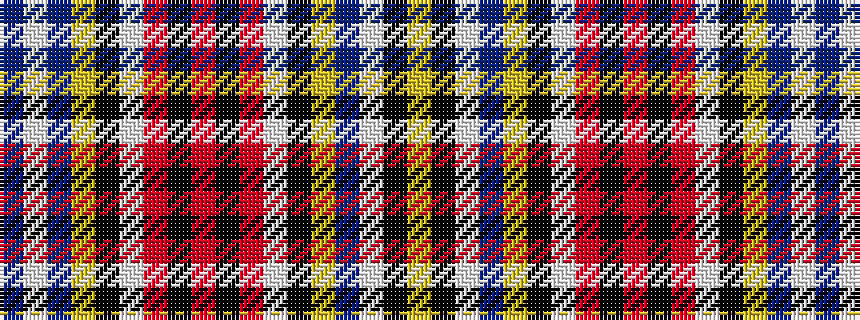

BWBYKWRKRKRWKYBWKY

It is a 18 stripe tartan.

<figure class="pat-woven">

<figcaption>idealised sample</figcaption>
</figure>

## Colour Sequence



## Tartans with this colour sequence

| Tartans |
|---------------|
| [Unnamed C19th](/variants/s18/n20lb2dp70ly2k13lb10r5k2r5k2r5lb10k13ly2do25lb18k2ly2~x2/)|
||
