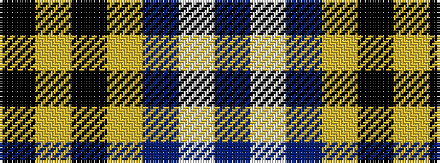

BWBYKYK

It is a 7 stripe tartan.

<figure class="pat-woven">

<figcaption>idealised sample</figcaption>
</figure>

## Colour Sequence



## Tartans with this colour sequence

| Tartans |
|---------------|
| [Gothenburg](/variants/s7/b26w28b14ly3k1ly2k1~x2/)|
||
| [Gothenburg/Goteborg](/variants/s7/db26w28db14ly3k1ly2k1~x2/)|
||
