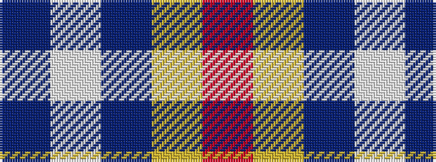

BWBYR

It is a 5 stripe tartan.

<figure class="pat-woven">

<figcaption>idealised sample</figcaption>
</figure>

## Colour Sequence



## Tartans with this colour sequence

| Tartans |
|---------------|
| [MacLeod of Argentina](/setts/s5/b10w3b12ly14r4~x2/)|
||
| [MacLeod, of Argentina](/setts/s5/db10w3db12ly14r4~x2/)|
||
