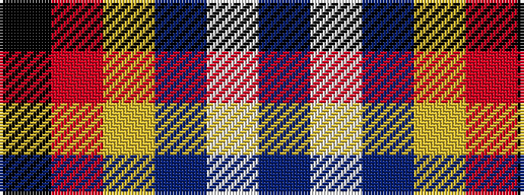

BWBYRK

It is a 6 stripe tartan.

<figure class="pat-woven">

<figcaption>idealised sample</figcaption>
</figure>

## Colour Sequence



## Tartans with this colour sequence

| Tartans |
|---------------|
| [De Grussa](/setts/s6/db24w4db24ly4r5k4~x2/)|
||
| [de Grussa (Personal)](/setts/s6/db24w4db24lo4r5k4~x2/)|
||
