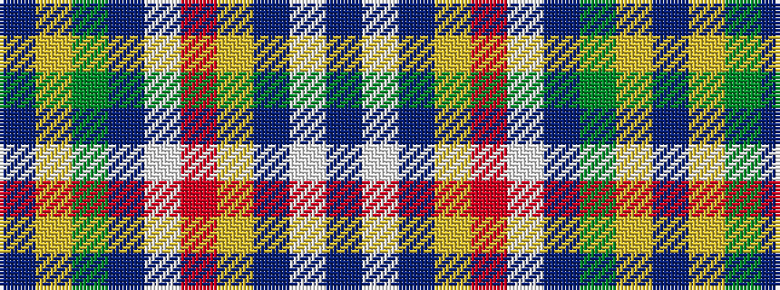

BWBYRWBGYB

It is a 10 stripe tartan.

<figure class="pat-woven">

<figcaption>idealised sample</figcaption>
</figure>

## Colour Sequence



## Tartans with this colour sequence

| Tartans |
|---------------|
| [MDF (Personal)](/variants/s10/db37w2db2ly2r17w2db2g17ly2db2~x2/)|
||
