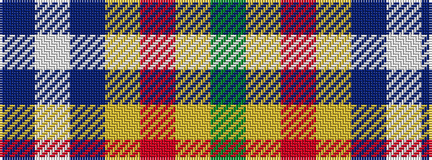

BWBYRYG

It is a 7 stripe tartan.

<figure class="pat-woven">

<figcaption>idealised sample</figcaption>
</figure>

## Colour Sequence



## Tartans with this colour sequence

| Tartans |
|---------------|
| [Tombow 140th Anniversary, The](/setts/s7/g4lo7r9lo9b20w2b2~x2/)|
||
| [Tombow 140th Anniversary, The](/setts/s7/g4ly7o9ly9db20w2db2~x2/)|
||
