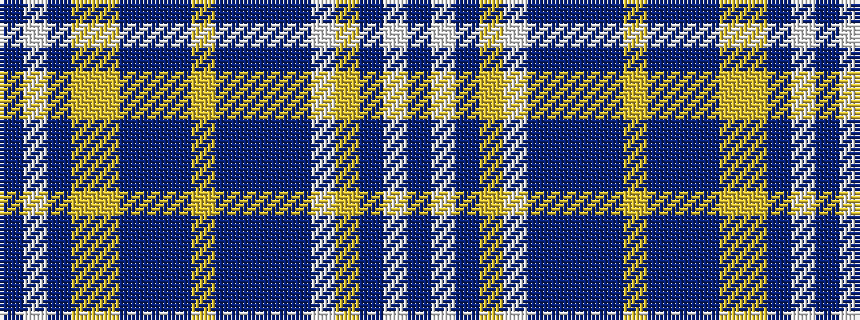

BWBYWBBBBYBBBYYBWB

It is a 18 stripe tartan.

<figure class="pat-woven">

<figcaption>idealised sample</figcaption>
</figure>

## Colour Sequence



## Tartans with this colour sequence

| Tartans |
|---------------|
| [Coast & Glen (Fishbox) Ltd](/setts/s18/db8w3db8lo2w3t2dbi19db19t1lg2dbi4db4t5lg2lo2dbi4w3db4~x2/)|
||
