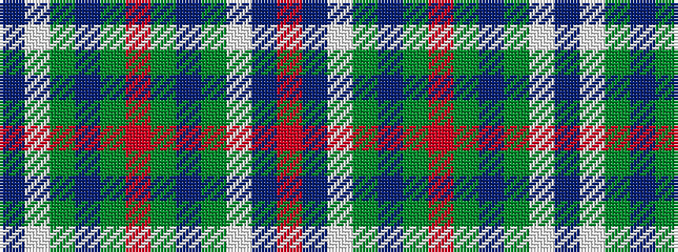

BWGBGRGBGWBR

It is a 12 stripe tartan.

<figure class="pat-woven">

<figcaption>idealised sample</figcaption>
</figure>

## Colour Sequence



## Tartans with this colour sequence

| Tartans |
|---------------|
| [Thompson (Pendleton)](/setts/s12/b15w13dy6b2dy2r2dy2b2dy6w13b15r3~x4/)|
||
