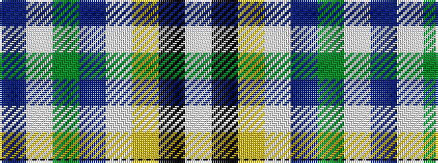

BWGBWYKW

It is a 8 stripe tartan.

<figure class="pat-woven">

<figcaption>idealised sample</figcaption>
</figure>

## Colour Sequence



## Tartans with this colour sequence

| Tartans |
|---------------|
| [Glasgow Islay (Fashion)](/setts/s8/db4lb50g4dp4w2ly2k3w2~x2/)|
||
