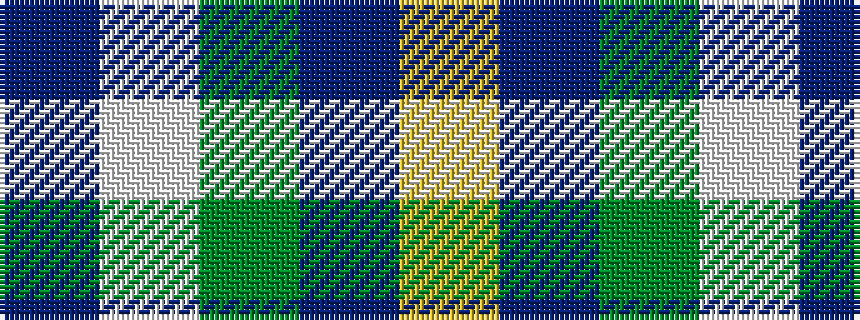

BWGBY

It is a 5 stripe tartan.

<figure class="pat-woven">

<figcaption>idealised sample</figcaption>
</figure>

## Colour Sequence



## Tartans with this colour sequence

| Tartans |
|---------------|
| [Bermuda (1986)](/setts/s5/t4w2g17t17lo2~x4/)|
||
