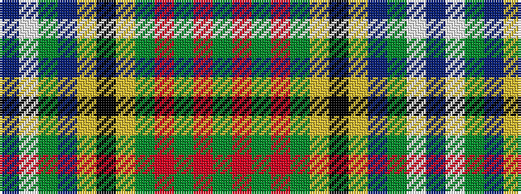

BWGBYKYGRGRG

It is a 12 stripe tartan.

<figure class="pat-woven">

<figcaption>idealised sample</figcaption>
</figure>

## Colour Sequence



## Tartans with this colour sequence

| Tartans |
|---------------|
| [Drennan](/setts/s12/db7w3g3db18lo3k15lo3g17r6g3r2g7~x2/)|
||
| [Paisley](/setts/s12/g7r2g3r5g17ly2k15ly2t22g3w2t7~x2/)|
||
| [Paisley](/setts/s12/db7w2g3db18ly2k15ly2g17r5g3r2g7~x2/)|
||
