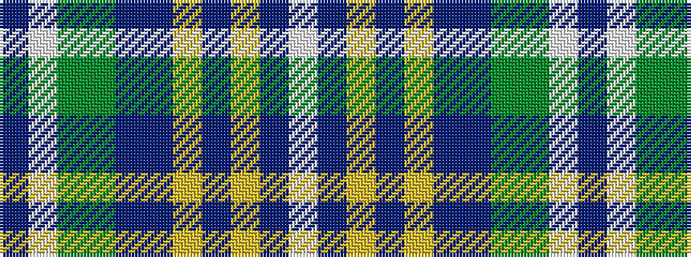

BWGGBBYBYBW

It is a 11 stripe tartan.

<figure class="pat-woven">

<figcaption>idealised sample</figcaption>
</figure>

## Colour Sequence



## Tartans with this colour sequence

| Tartans |
|---------------|
| [Dundee Carers' Centre](/setts/s11/lp66db2lo14db2ly5p8db12g60gi60lp2db25/)|
||
