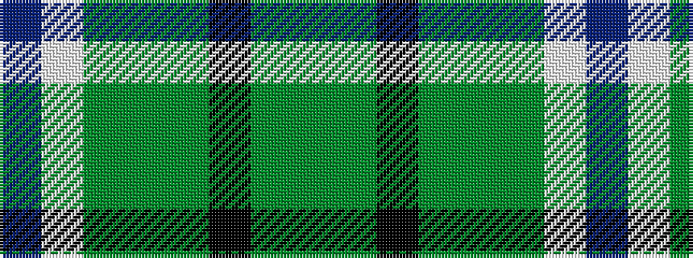

BWGGGKGG

It is a 8 stripe tartan.

<figure class="pat-woven">

<figcaption>idealised sample</figcaption>
</figure>

## Colour Sequence



## Tartans with this colour sequence

| Tartans |
|---------------|
| [Gairloch](/setts/s8/y24y1k9y1y9y2w2db2~x2/)|
||
