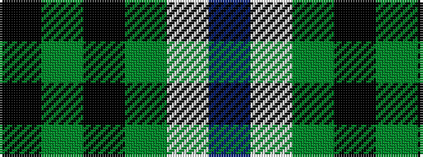

BWGKGK

It is a 6 stripe tartan.

<figure class="pat-woven">

<figcaption>idealised sample</figcaption>
</figure>

## Colour Sequence



## Tartans with this colour sequence

| Tartans |
|---------------|
| [MacKay Dress](/setts/s6/k4g23k23g2w23b4~x2/)|
||
| [MacKay, Dress (Corporate)](/setts/s6/k4g14k14g2w14b3~x2/)|
||
