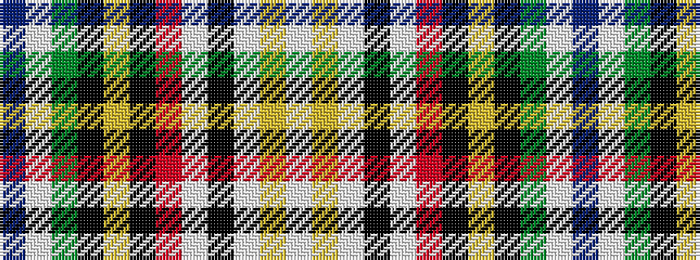

BWGKYKRWKWYW

It is a 12 stripe tartan.

<figure class="pat-woven">

<figcaption>idealised sample</figcaption>
</figure>

## Colour Sequence



## Tartans with this colour sequence

| Tartans |
|---------------|
| [EthosEnergy](/variants/s12/b10w1g10k40lr8k40r10w1k10w1lr10w1~x2/)|
||
