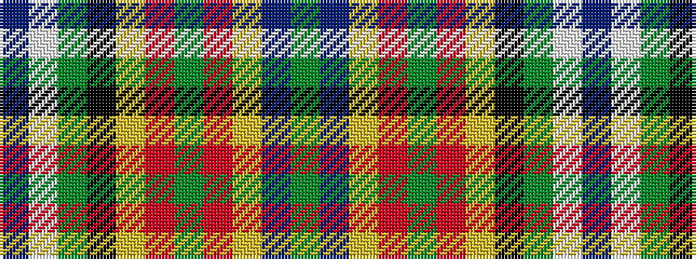

BWGKYRGRYBG

It is a 11 stripe tartan.

<figure class="pat-woven">

<figcaption>idealised sample</figcaption>
</figure>

## Colour Sequence



## Tartans with this colour sequence

| Tartans |
|---------------|
| [Smithsonian (Corporate)](/variants/s11/db2w2y24k24ly1r2y2r2ly1db24y2~x2/)|
||
