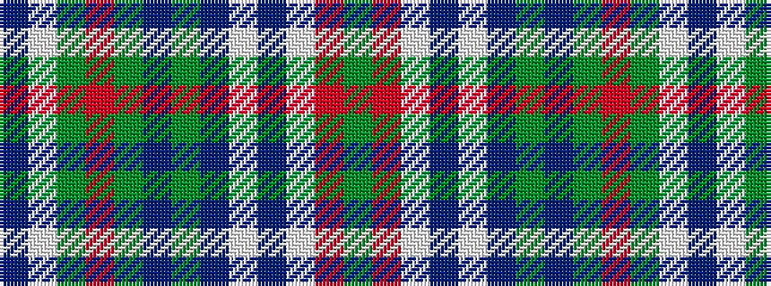

BWGRGBGBWBWRG

It is a 13 stripe tartan.

<figure class="pat-woven">

<figcaption>idealised sample</figcaption>
</figure>

## Colour Sequence



## Tartans with this colour sequence

| Tartans |
|---------------|
| [Maine Dirigo](/setts/s13/db4lb1g4r2g14db2g1db1lb1db1lb13r1g1~x4/)|
||
