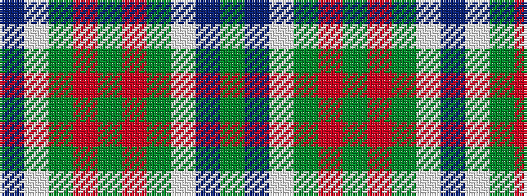

BWGRGRGWBG

It is a 10 stripe tartan.

<figure class="pat-woven">

<figcaption>idealised sample</figcaption>
</figure>

## Colour Sequence



## Tartans with this colour sequence

| Tartans |
|---------------|
| [Patterson (Red) Clan Tartan Tartan Number: 2191. Earliest known date: 1993 A personal tartan designed by Marge Warren for a John Patterson. No other details known. See products available Copyright © Blair Urquhart, Comrie, 2015](/setts/s10/db12w1dg12r12dg2r12dg12w1db12g3~x2/)|
||
