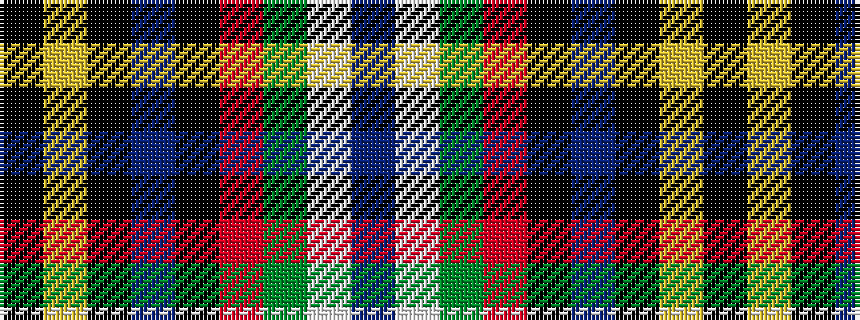

BWGRKBKYK

It is a 9 stripe tartan.

<figure class="pat-woven">

<figcaption>idealised sample</figcaption>
</figure>

## Colour Sequence



## Tartans with this colour sequence

| Tartans |
|---------------|
| [Black Hills](/setts/s9/db3w2g14r14k2db7k9ly2k2~x2/)|
||
