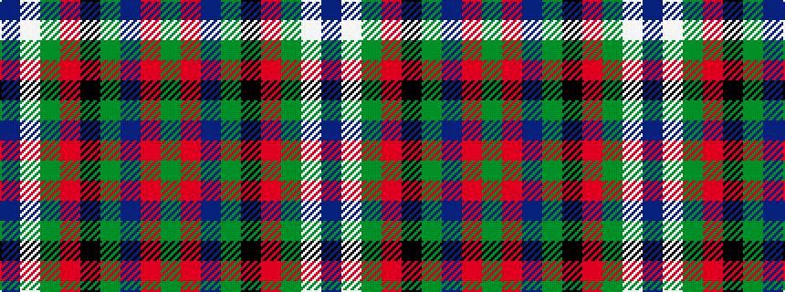

BWGRKGBRG

It is a 9 stripe tartan.

<figure class="pat-woven">

<figcaption>idealised sample</figcaption>
</figure>

## Colour Sequence



## Tartans with this colour sequence

| Tartans |
|---------------|
| [MacCraig](/variants/s9/dr2lb1g7r1k7g1db7r1g2~x8/)|
||
