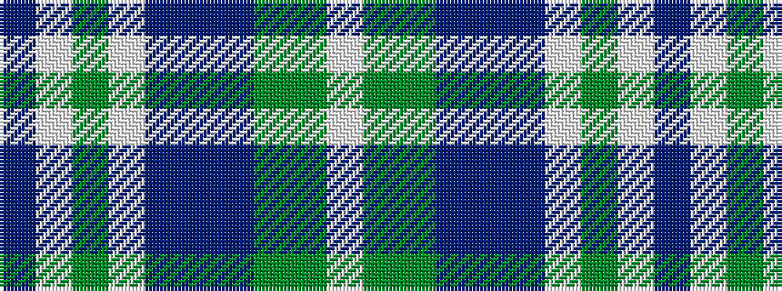

BWGWBBBGGW

It is a 10 stripe tartan.

<figure class="pat-woven">

<figcaption>idealised sample</figcaption>
</figure>

## Colour Sequence



## Tartans with this colour sequence

| Tartans |
|---------------|
| [Blue Spruce, The (Fashion)](/setts/s10/db2w18g2w2db3b3db3g6g24w2~x2/)|
||
