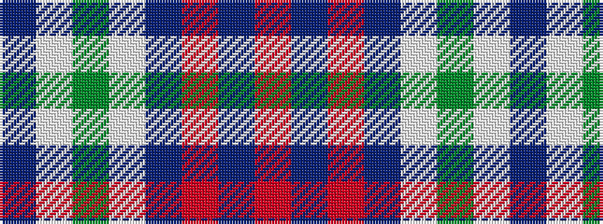

BWGWBRBR

It is a 8 stripe tartan.

<figure class="pat-woven">

<figcaption>idealised sample</figcaption>
</figure>

## Colour Sequence



## Tartans with this colour sequence

| Tartans |
|---------------|
| [Raith Rovers F.C.](/setts/s8/db6w2g2w3db24r1db35r2~x2/)|
||
