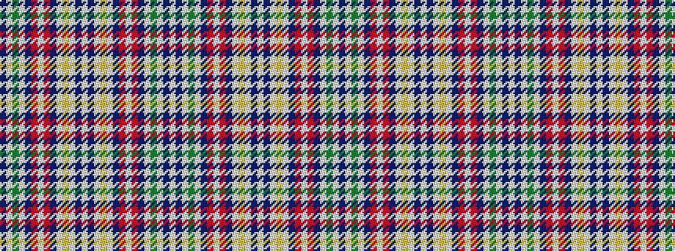

BWGWBRWRBWYWBWBWYWBRWRBWGWBW

It is a 28 stripe tartan.

<figure class="pat-woven">

<figcaption>idealised sample</figcaption>
</figure>

## Colour Sequence



## Tartans with this colour sequence

| Tartans |
|---------------|
| [Womble](/variants/s28/w3db1w1g5w1db1r2w1r2db1w1lo4w1db1w3~x8/)|
||
