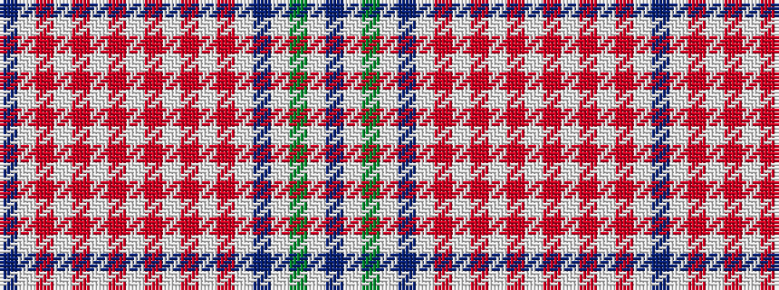

BWGWBWRWRWRWRWRWRWB

It is a 19 stripe tartan.

<figure class="pat-woven">

<figcaption>idealised sample</figcaption>
</figure>

## Colour Sequence



## Tartans with this colour sequence

| Tartans |
|---------------|
| [Shaw Dress (Personal)](/variants/s19/dp3w14g8w10dp4w32r1w2r1w2r1w2r1w2r1w2r1w6t3~x2/)|
||
