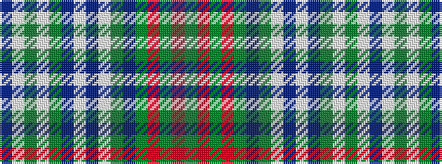

BWGWGBWBWGBGRGRG

It is a 16 stripe tartan.

<figure class="pat-woven">

<figcaption>idealised sample</figcaption>
</figure>

## Colour Sequence



## Tartans with this colour sequence

| Tartans |
|---------------|
| [Gordon #3](/setts/s16/db14w1dg8w1dg16t6w1db14w1dg14t6dg6r8dg6r8dg1~x2/)|
||
| [Gordon 1](/setts/s16/db14w1g8w1dg16t6w1db14w1g14t6g6r8dg6r8dg1~x2/)|
||
