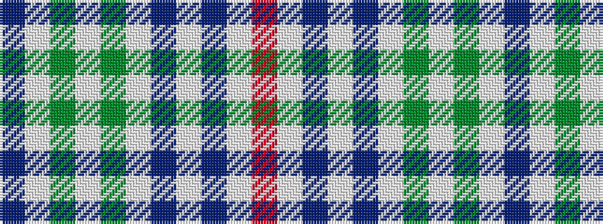

BWGWGWBWBWR

It is a 11 stripe tartan.

<figure class="pat-woven">

<figcaption>idealised sample</figcaption>
</figure>

## Colour Sequence



## Tartans with this colour sequence

| Tartans |
|---------------|
| [Shaw of Tordarroch, Mrs (Personal)](/variants/s11/o8lb46db4lb4db4lb5y7lb7y7lb4db2~x2/)|
||
