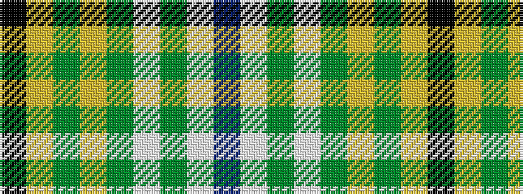

BWGWGYGYK

It is a 9 stripe tartan.

<figure class="pat-woven">

<figcaption>idealised sample</figcaption>
</figure>

## Colour Sequence



## Tartans with this colour sequence

| Tartans |
|---------------|
| [McClurg, William Thomas (Personal)](/variants/s9/k4ly1g2ly1g32lt1g3lt32db3~x2/)|
||
