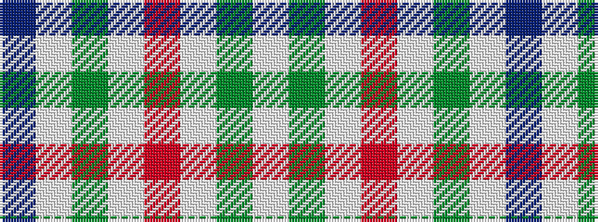

BWGWRWGW

It is a 8 stripe tartan.

<figure class="pat-woven">

<figcaption>idealised sample</figcaption>
</figure>

## Colour Sequence



## Tartans with this colour sequence

| Tartans |
|---------------|
| [Milne (Personal)](/variants/s8/w12dg2w12r17w12dg2w5b2~x4/)|
||
