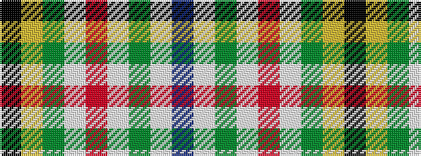

BWGWRWGYK

It is a 9 stripe tartan.

<figure class="pat-woven">

<figcaption>idealised sample</figcaption>
</figure>

## Colour Sequence



## Tartans with this colour sequence

| Tartans |
|---------------|
| [Spirit of 1994](/setts/s9/k13ly4g15w4r13w4g15w4db13~x2/)|
||
