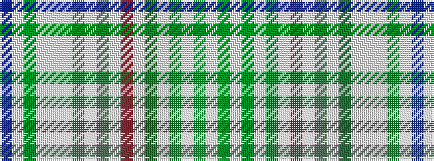

BWGWWWGWGWRWGWGWGW

It is a 18 stripe tartan.

<figure class="pat-woven">

<figcaption>idealised sample</figcaption>
</figure>

## Colour Sequence



## Tartans with this colour sequence

| Tartans |
|---------------|
| [Shedor (2013)](/setts/s18/lb25g3lb4g4lb5g5lb15r6lb5g19lb8g26lb4w4lb4g7lb4t21~x2/)|
||
| [Shedor (2013)](/setts/s18/lb25g3lb4g4lb5g5lb15r6lb5g19lb8g26lb4w4lb4g7lb4db21~x2/)|
||
