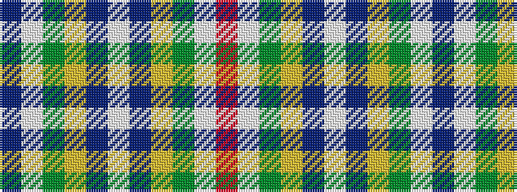

BWGYBWBYGWR

It is a 11 stripe tartan.

<figure class="pat-woven">

<figcaption>idealised sample</figcaption>
</figure>

## Colour Sequence



## Tartans with this colour sequence

| Tartans |
|---------------|
| [MacKessog Wedding (Fashion)](/variants/s11/n1w8y2lo2db6w1db6lo2y2w8r1~x4/)|
||
