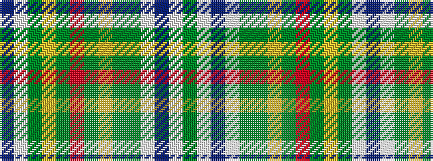

BWGYGRGYGGWBWG

It is a 14 stripe tartan.

<figure class="pat-woven">

<figcaption>idealised sample</figcaption>
</figure>

## Colour Sequence



## Tartans with this colour sequence

| Tartans |
|---------------|
| [Freiburg](/variants/s14/db5w5y36ly3y3r3y3ly3y9dg8w3db3w3dg3~x2/)|
||
