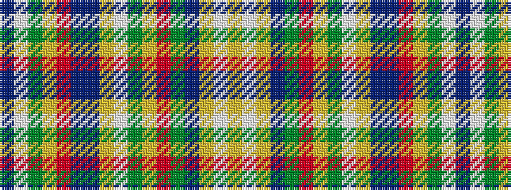

BWGYRBBYWGYRGBYWY

It is a 17 stripe tartan.

<figure class="pat-woven">

<figcaption>idealised sample</figcaption>
</figure>

## Colour Sequence



## Tartans with this colour sequence

| Tartans |
|---------------|
| [St Anne de Portneuf Canadian District Tartan](/variants/s17/t2w3dg7ly1r4do2db6loi2w1dg2ly6r2dy4db1loi7w3lo2~x2/)|
||
