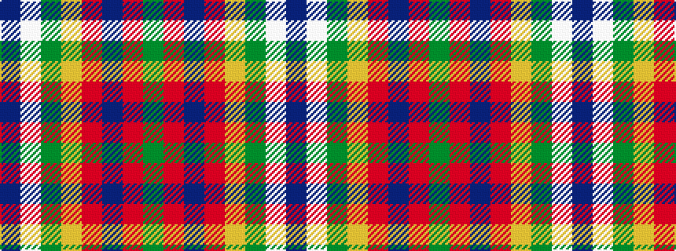

BWGYRBRG

It is a 8 stripe tartan.

<figure class="pat-woven">

<figcaption>idealised sample</figcaption>
</figure>

## Colour Sequence



## Tartans with this colour sequence

| Tartans |
|---------------|
| [Loyalhanna](/variants/s8/db15lb2g2ly15r3db21r3g15~x2/)|
||
