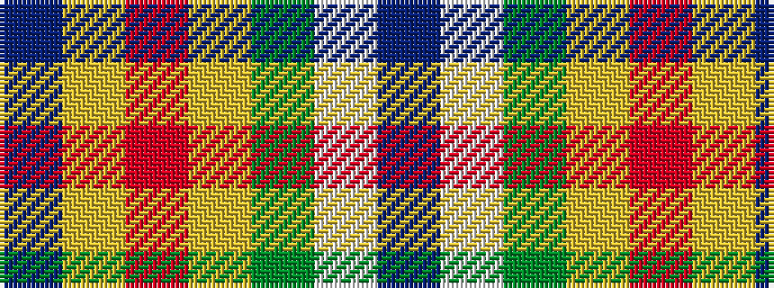

BWGYRYB

It is a 7 stripe tartan.

<figure class="pat-woven">

<figcaption>idealised sample</figcaption>
</figure>

## Colour Sequence



## Tartans with this colour sequence

| Tartans |
|---------------|
| [Kuznetsov (2014)](/setts/s7/db49ly12r12ly12dg32w8db3/)|
||
