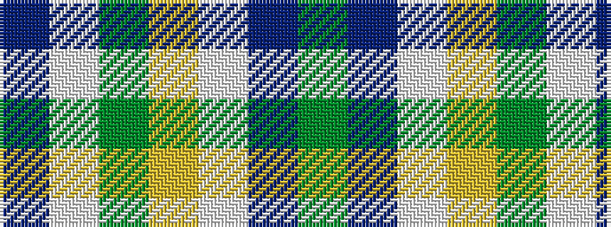

BWGYWBG

It is a 7 stripe tartan.

<figure class="pat-woven">

<figcaption>idealised sample</figcaption>
</figure>

## Colour Sequence



## Tartans with this colour sequence

| Tartans |
|---------------|
| [Lindley-Highfield of Ballumbie Castle](/variants/s7/g7p3w1lg2g1lp2p1~x8/)|
||
