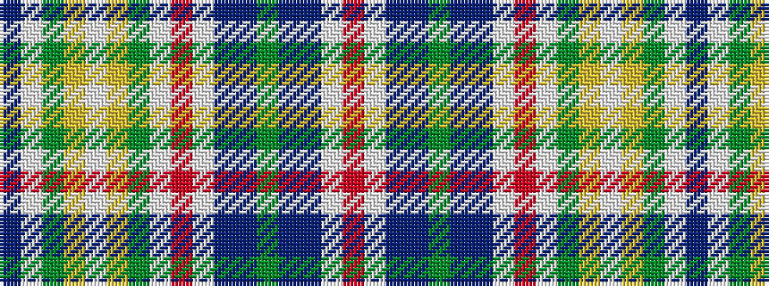

BWGYWYGWRWBBGBBWR

It is a 17 stripe tartan.

<figure class="pat-woven">

<figcaption>idealised sample</figcaption>
</figure>

## Colour Sequence



## Tartans with this colour sequence

| Tartans |
|---------------|
| [7th Cavalry (Military)](/setts/s17/n31w2g2ly1w1ly1g2w1r5w2n3p2g1p2n3w2r2~x2/)|
||
