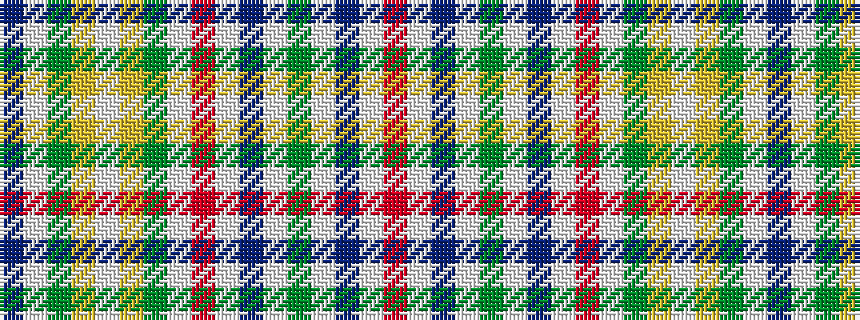

BWGYWYGWRWBWGWBWR

It is a 17 stripe tartan.

<figure class="pat-woven">

<figcaption>idealised sample</figcaption>
</figure>

## Colour Sequence



## Tartans with this colour sequence

| Tartans |
|---------------|
| [Cavalry, 7th..](/variants/s17/db48w4g3ly2w2ly2g3w2r8w4db5lp3g2lp3db5w4r4/)|
||
