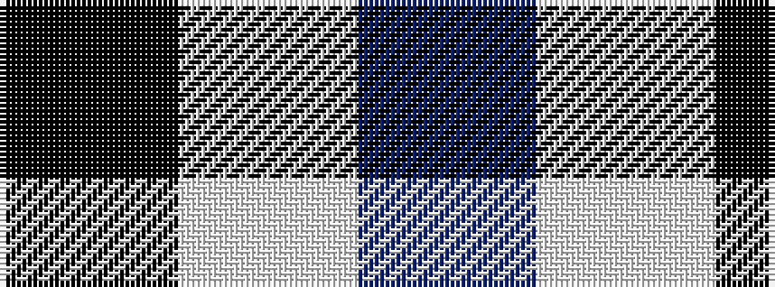

BWK

It is a 3 stripe tartan.

<figure class="pat-woven">

<figcaption>idealised sample</figcaption>
</figure>

## Colour Sequence



## Tartans with this colour sequence

| Tartans |
|---------------|
| [Fily (Verneuil L'tang) (Personal)](/setts/s3/k20w2t1~x6/)|
||
