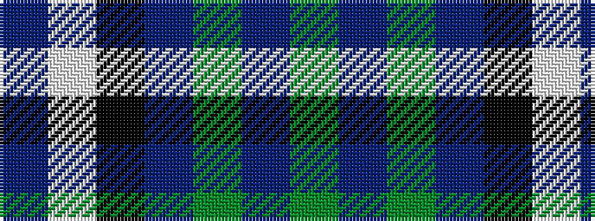

BWKBGBG

It is a 7 stripe tartan.

<figure class="pat-woven">

<figcaption>idealised sample</figcaption>
</figure>

## Colour Sequence



## Tartans with this colour sequence

| Tartans |
|---------------|
| [Because You Care](/variants/s7/dg16dp4dg8dp13k3w26dp10~x2/)|
||
