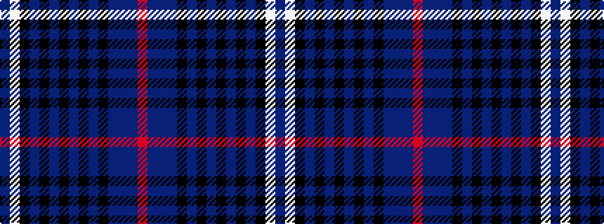

BWKBKBKBKBKBBBR

It is a 15 stripe tartan.

<figure class="pat-woven">

<figcaption>idealised sample</figcaption>
</figure>

## Colour Sequence



## Tartans with this colour sequence

| Tartans |
|---------------|
| [Passion of Scotland, Purple (Fashion](/setts/s15/dbi7w1k3dp3k3dbi3k13dp2k2dp2k2dp23db3dp2m2~x2/)|
||
