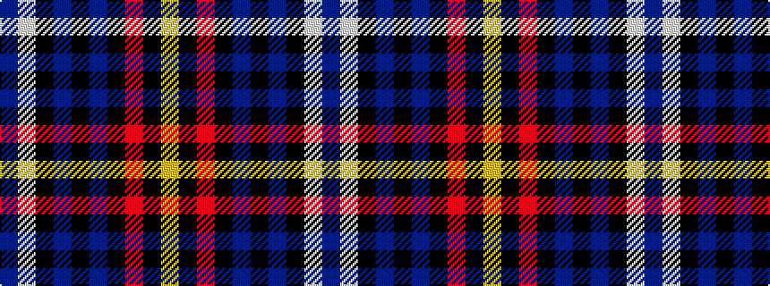

BWKBKBKRKY

It is a 10 stripe tartan.

<figure class="pat-woven">

<figcaption>idealised sample</figcaption>
</figure>

## Colour Sequence



## Tartans with this colour sequence

| Tartans |
|---------------|
| [Sidey (Dundee) Dress (Personal)](/variants/s10/db4w1k2db25k12dbi1k2r16k2lo1~x2/)|
||
| [Sidey Dress Tartan (Name)](/variants/s10/db4w1k2db25k12b1k2r16k2lo1~x2/)|
||
