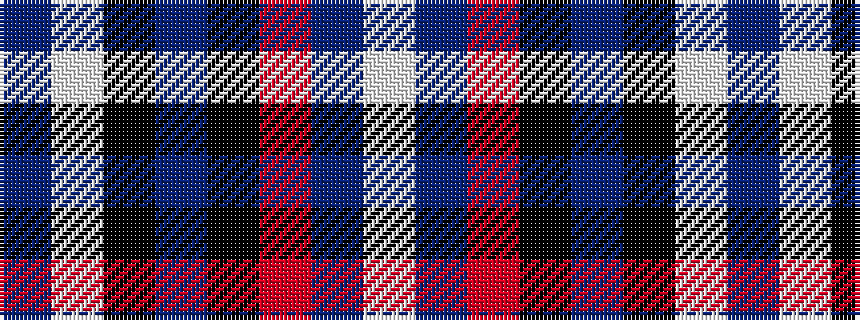

BWKBKRBW

It is a 8 stripe tartan.

<figure class="pat-woven">

<figcaption>idealised sample</figcaption>
</figure>

## Colour Sequence



## Tartans with this colour sequence

| Tartans |
|---------------|
| [Stephen F Austin State University](/setts/s8/dp15w2k3dp30k4o3dp15w6~x2/)|
||
