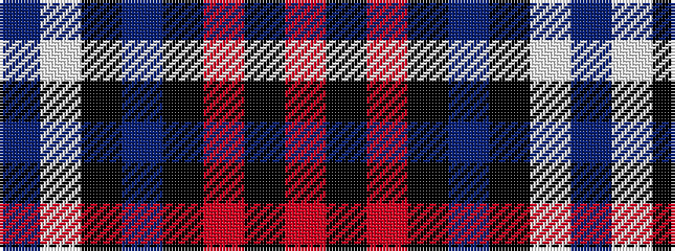

BWKBKRKR

It is a 8 stripe tartan.

<figure class="pat-woven">

<figcaption>idealised sample</figcaption>
</figure>

## Colour Sequence



## Tartans with this colour sequence

| Tartans |
|---------------|
| [Braemar or Blair Atholl](/setts/s8/do2w2k6do3k2o14k1o1~x4/)|
||
