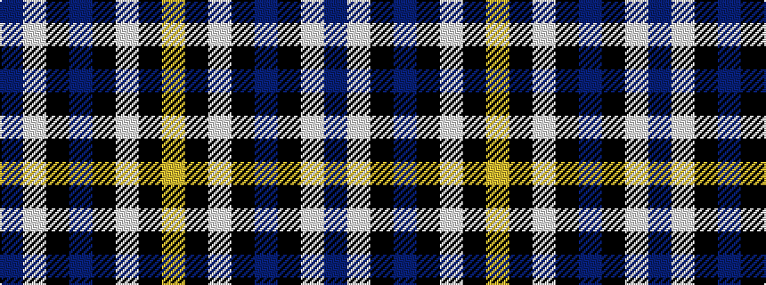

BWKBKWKY

It is a 8 stripe tartan.

<figure class="pat-woven">

<figcaption>idealised sample</figcaption>
</figure>

## Colour Sequence



## Tartans with this colour sequence

| Tartans |
|---------------|
| [Marine Harvest Scotland (Corporate)](/variants/s8/b10lb2k2b1k6lb1k45lo2~x2/)|
||
