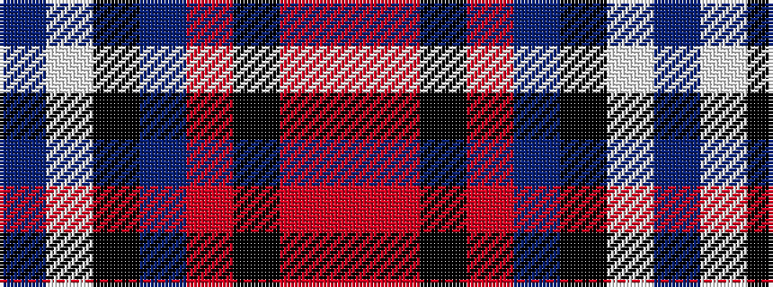

BWKBRKRR

It is a 8 stripe tartan.

<figure class="pat-woven">

<figcaption>idealised sample</figcaption>
</figure>

## Colour Sequence



## Tartans with this colour sequence

| Tartans |
|---------------|
| [Akintiev (2014)](/variants/s8/db22w5k9db20o14k9o11r1~x2/)|
||
