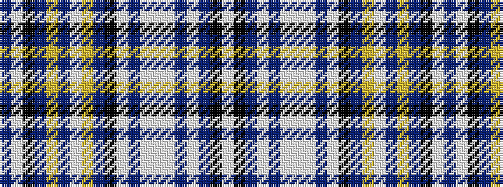

BWKBYBWYBKWBWWWBWBKW

It is a 20 stripe tartan.

<figure class="pat-woven">

<figcaption>idealised sample</figcaption>
</figure>

## Colour Sequence



## Tartans with this colour sequence

| Tartans |
|---------------|
| [Lions International](/setts/s20/b60lb2k2b2lo2b10lb3lo12b10k2lb5b5lb2lb2lb2b5lb4b4k4lb8/)|
||
