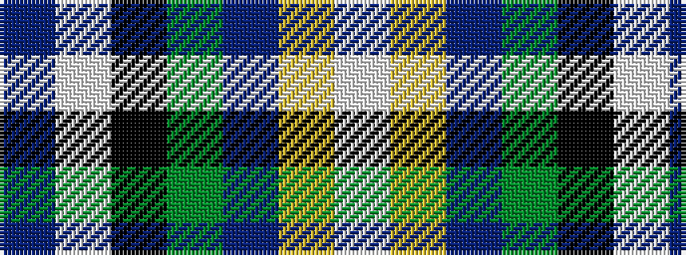

BWKGBYW

It is a 7 stripe tartan.

<figure class="pat-woven">

<figcaption>idealised sample</figcaption>
</figure>

## Colour Sequence



## Tartans with this colour sequence

| Tartans |
|---------------|
| [Mellor, Phillip (Oldham)](/variants/s7/do8w8k16dg32dp3lo5w5~x2/)|
||
