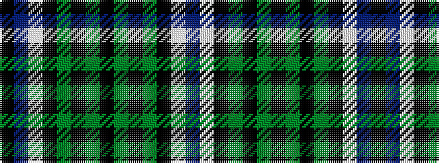

BWKGKGKGKGKWBK

It is a 14 stripe tartan.

<figure class="pat-woven">

<figcaption>idealised sample</figcaption>
</figure>

## Colour Sequence



## Tartans with this colour sequence

| Tartans |
|---------------|
| [Norwich No.033](/variants/s14/dp16w2k16g16k2g16k16g16k2g16k16w2dp16k1~x2/)|
||
