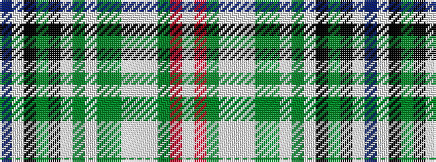

BWKGKWGWGGWWWGRW

It is a 16 stripe tartan.

<figure class="pat-woven">

<figcaption>idealised sample</figcaption>
</figure>

## Colour Sequence



## Tartans with this colour sequence

| Tartans |
|---------------|
| [Manhattan Financial](/variants/s16/w48r2y5lb18w20lb8y6g2lb6y5lb4k20y8k14w24db4/)|
||
